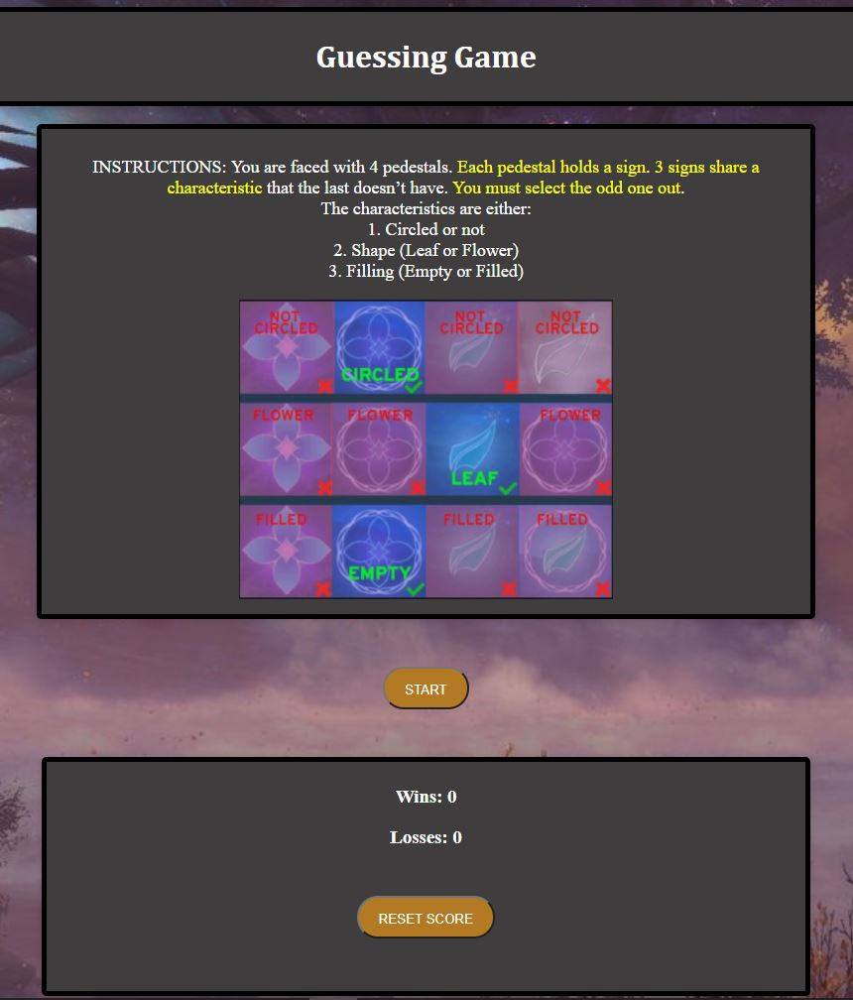
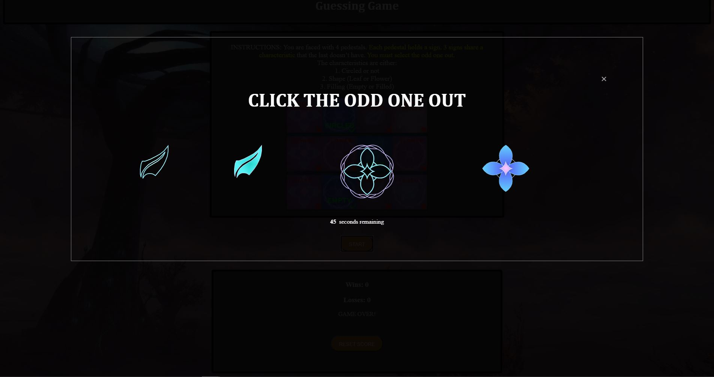

# Quiz-Code

This project is about creating a quiz that allows the person to have select one of the multiple answers presented to them. If they press on the start button, it'll show four images that looks similar but one of them is different. By selecting the odd one out, which is the correct answer, the player will then be able to move onto the next multiple choice that presents them yet another randomized set of images.

## Purpose of this project

If done properly, the page should do all of its specified functions and allow other users to effortlessly navigate through the page. This project demonstrates that they should know how to use Javascript and to add event functions etc so that players can interact with the page and then store their scores onto their local storage if prompted to do so.

## Screenshots

## Link

https://github.com/fongvang09/Quiz-Code/settings

https://fongvang09.github.io/Quiz-Code/

Below is how I wanted it to function but due to lack of time and skills..... And then add timer etc.
Scroll down to "Click here to practice" to begin on the link.

https://mythictrap.com/dungeons/mistsOfTirnaScithe/mistcaller/1
